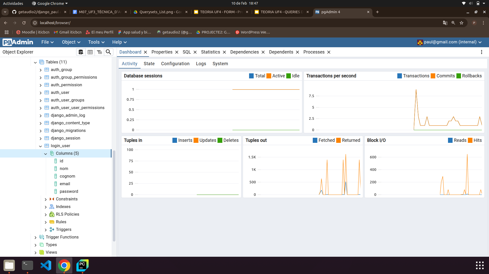

# django_paul

## ACTIVITAT 14
### Configuració projecte

### Creació de la nova aplicació

### Crear model de l'aplicació

## Video fent les proves
- Es comprova que no es pot accedir al main page sense haver fet login
- Credencials errònies donen un missatge d'error
- Fer login sense sessions dona access al main page un cop i després retorna al login
- Fer login amb sessions fa que l'usuari es quedi al main page fins fer logout. El login amb sessions també serà inaccessible després de loguejar.
- Es comprova que el logout ha esborrat la sessió. Retorna al login page i el main page es torna inaccessible.

https://github.com/user-attachments/assets/735c807a-80f5-478b-96e9-b2b1ccc16f56

